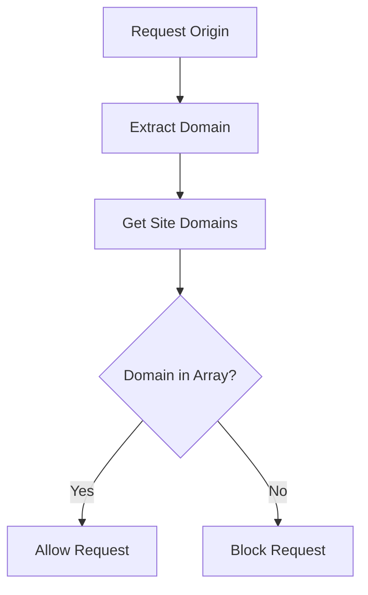
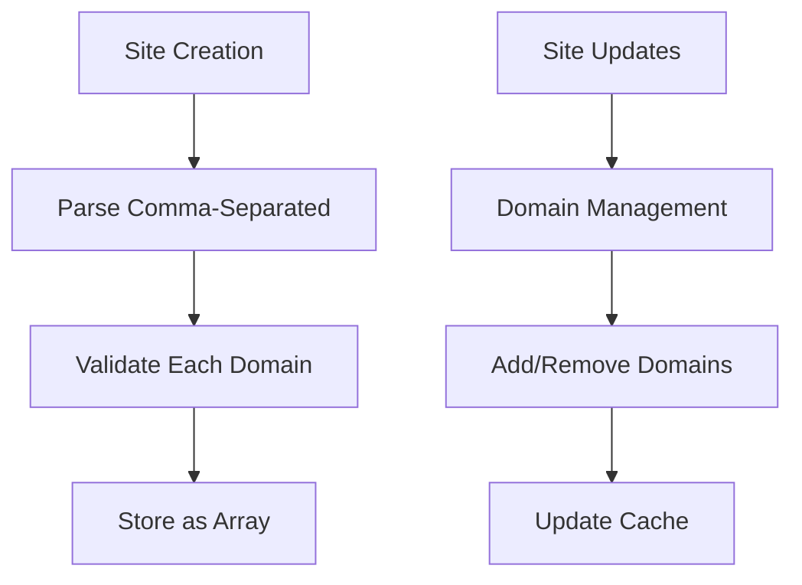
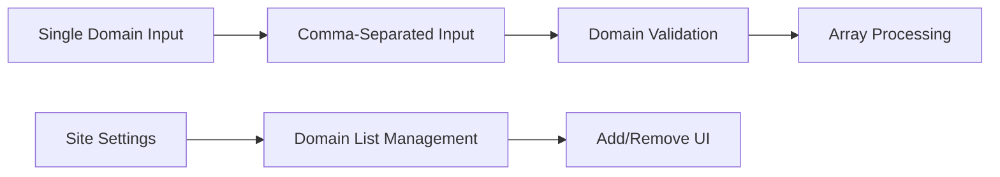

# Multi-Domain Support Implementation Plan

## Overview

This plan implements multi-domain support for Rybbit Analytics sites by replacing the single `domain` field with a `domains` array field. The implementation will maintain the current UI flow while allowing comma-separated domain input and using the first domain as the default site name.

## Problem Statement

Currently, Rybbit Analytics sites can only have one registered domain, which blocks tracking requests from additional domains (e.g., website.com and app.website.com). Users need the ability to track analytics across multiple related domains for the same site.

## Solution Architecture

### 1. Database Schema Migration

```mermaid
graph TD
    A[Current Schema] --> B[Migration Script]
    B --> C[New Schema]

    A1[sites.domain: text] --> B1[Convert to Array]
    B1 --> C1[sites.domains: text[]]

    A2[Unique Constraint on domain] --> B2[Remove Constraint]
    B2 --> C2[No Unique Constraint on domains]
```

**Changes Required:**

- Replace `domain: text().notNull().unique()` with `domains: text().array().notNull()`
- Create migration script to convert existing single domains to arrays
- Remove unique constraint on domain field

### 2. Site Configuration System Updates

```mermaid
graph LR
    A[SiteConfig Class] --> B[Interface Update]
    B --> C[Method Updates]
    C --> D[Cache Updates]

    B1[SiteConfigData.domain: string] --> B2[SiteConfigData.domains: string[]]
    C1[getSiteDomain] --> C2[getSiteDomains + isDomainAllowed]
    D1[Single Domain Cache] --> D2[Domains Array Cache]
```

**Changes Required:**

- Update `SiteConfigData` interface to use `domains: string[]`
- Replace `getSiteDomain()` with `getSiteDomains()` and `isDomainAllowed(domain)`
- Update cache loading and update methods

### 3. Domain Validation Logic



**Changes Required:**

- Update `trackEvent.ts` origin validation to check against domains array
- Modify domain validation functions throughout the system

### 4. API Endpoints Updates



**Changes Required:**

- Update all site-related API endpoints
- Modify domain change endpoint to handle arrays
- Update site creation to parse comma-separated domains

### 5. Frontend Interface Updates



**Changes Required:**

- Update `AddSite.tsx` to handle comma-separated input
- Modify `SiteSettings.tsx` for domain array management
- Update TypeScript interfaces

## Detailed Implementation Steps

### Phase 1: Database Schema & Migration

1. **Create Migration Script**

   - Convert existing `domain` fields to `domains` arrays
   - Handle data migration safely
   - Remove unique constraint

2. **Update Schema Definition**
   - Modify `sites` table in `server/src/db/postgres/schema.ts`
   - Update Drizzle ORM types

### Phase 2: Core System Updates

1. **Site Configuration System**

   - Update `SiteConfigData` interface in `server/src/lib/siteConfig.ts`
   - Modify `SiteConfig` class methods
   - Update cache loading logic

2. **Domain Validation**
   - Update `server/src/tracker/trackEvent.ts` validation logic
   - Modify origin checking functions
   - Update error handling

### Phase 3: API Layer Updates

1. **Site Management Endpoints**

   - Update `server/src/api/sites/addSite.ts` for comma-separated parsing
   - Modify `server/src/api/sites/changeSiteDomain.ts` for array handling
   - Update all site-related endpoints in `server/src/api/sites/`

2. **Remove Deprecated Code**
   - Delete `server/src/lib/allowedDomains.ts` file
   - Clean up related imports

### Phase 4: Frontend Updates

1. **Site Creation Interface**

   - Update `client/src/app/components/AddSite.tsx` for comma-separated input
   - Add domain validation and parsing
   - Update form handling

2. **Site Management Interface**
   - Update `client/src/components/SiteSettings/SiteSettings.tsx` for domain arrays
   - Add domain list management UI
   - Update TypeScript interfaces in `client/src/api/admin/sites.ts`

### Phase 5: Testing & Validation

1. **Integration Testing**

   - Test domain validation with multiple domains
   - Verify tracking works across all domains
   - Test site creation and management

2. **Migration Testing**
   - Test data migration script
   - Verify existing sites work correctly
   - Test rollback procedures

## Files to be Modified

### Backend Files

- `server/src/db/postgres/schema.ts` - Update sites table schema
- `server/src/lib/siteConfig.ts` - Update configuration system
- `server/src/tracker/trackEvent.ts` - Update domain validation
- `server/src/api/sites/addSite.ts` - Update site creation
- `server/src/api/sites/changeSiteDomain.ts` - Update domain management
- `server/src/api/sites/getSite.ts` - Update site retrieval
- `server/src/api/sites/deleteSite.ts` - Update cache cleanup
- `server/src/api/sites/changeSitePublic.ts` - Update cache handling
- `server/src/api/sites/changeSiteSalt.ts` - Update cache handling
- `server/src/api/sites/changeSiteBlockBots.ts` - Update cache handling
- `server/src/lib/allowedDomains.ts` - **DELETE THIS FILE**

### Frontend Files

- `client/src/app/components/AddSite.tsx` - Update site creation UI
- `client/src/components/SiteSettings/SiteSettings.tsx` - Update domain management UI
- `client/src/api/admin/sites.ts` - Update TypeScript interfaces

### Migration Files

- Create new migration script for database schema changes

## Risk Mitigation

### Data Migration Risks

- **Backup Strategy**: Full database backup before migration
- **Rollback Plan**: Revert migration script available
- **Testing**: Thorough testing on staging environment

### API Compatibility

- **Gradual Rollout**: Deploy backend changes first
- **Error Handling**: Comprehensive error handling for edge cases
- **Monitoring**: Enhanced logging during transition

### Performance Considerations

- **Array Queries**: Optimize PostgreSQL array queries
- **Cache Efficiency**: Maintain efficient domain lookup cache
- **Index Strategy**: Consider indexing strategy for domains array

## Success Criteria

### Functional Requirements

1. Sites can have multiple domains registered
2. Tracking works from any registered domain
3. Site creation uses first domain as default name
4. Domain management through settings interface
5. Existing sites continue to work without interruption

### Technical Requirements

1. Zero data loss during migration
2. Maintained or improved performance
3. Clean removal of deprecated code
4. Comprehensive error handling
5. Proper TypeScript type safety

### User Experience

1. Seamless transition for existing users
2. Intuitive multi-domain input interface (comma-separated)
3. Clear domain management in settings
4. Helpful validation messages

## Implementation Timeline

### Week 1: Backend Foundation

- Database schema migration
- Core system updates (siteConfig, trackEvent)
- API endpoint updates

### Week 2: Frontend Integration

- UI updates for site creation and management
- TypeScript interface updates
- Integration testing

### Week 3: Testing & Deployment

- Comprehensive testing
- Performance optimization
- Production deployment

## Post-Implementation

### Monitoring

- Track domain validation performance
- Monitor for any tracking issues
- Validate cache efficiency

### Documentation

- Update API documentation
- Update user guides
- Document new domain management features

### Future Enhancements

- Consider domain-specific analytics views
- Implement domain-level permissions
- Add domain verification features
